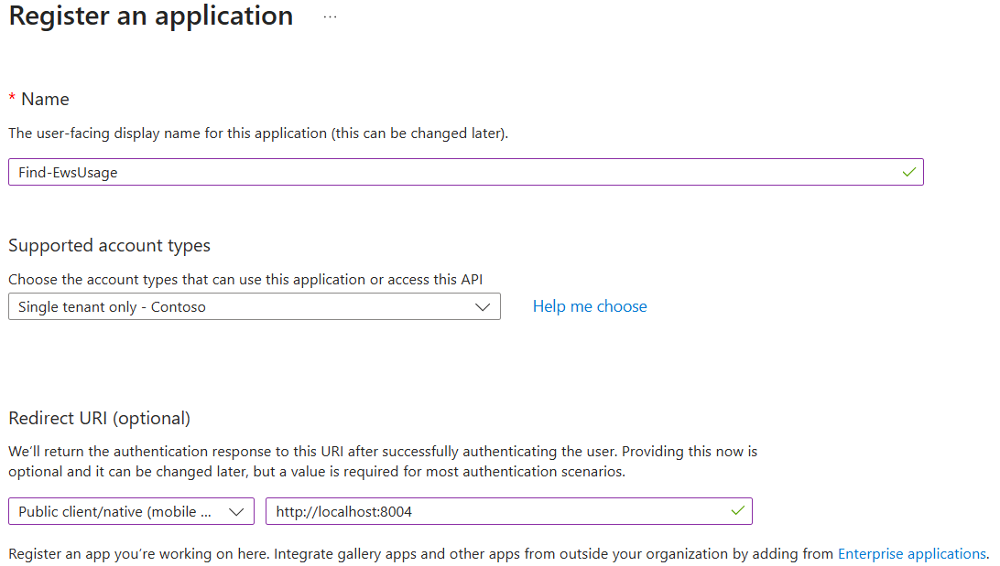

Create an App registration for the Find-EwsUsage Script
You can use the following steps to create the required app registration to use the Find-EwsUsage script with your tenant.
1.	Sign into the Microsoft Entra Admin Center
2.	Select App registrations
3.	Select New registration
•	Enter the Name for the application
•	If using delegated permissions, select Public client/native (mobile & desktop) under Redirect URI and enter the value http://localhost:8004
•	Select Register
 
4.	Note the Application (client) ID and the Directory (tenant) ID. These are the values used when running the script for the OAuthClientID and OAuthTenantID parameters
 
5.	Select Certificates & secrets
6.	Here you can add either a New client secret or Upload certificate. If you are using a client secret, go to step 10.
7.	Select Upload certificate
8.	In the Upload certificate window, select your certificate file, enter a description, and select Add

 

9.	Note the Thumbprint value as this as this is used for the OAuthCertificate value when running the script. If you are not using a client secret, go to step 
10.	Select New client secret
11.	In the Add a client secret window, enter a description, select an expires value, and select Add
 

12.	You must copy the Value for the client secret as it will never be visible again.

 

13.	Select API permissions
14.	Select Add a permission
15.	Select Microsoft Graph
16.	Select either Delegated permissions or Application permissions
17.	Add the following permissions:
•	AuditLogsQuery.Read.All
•	Application.Read.All
•	AuditLog.Read.All
•	Directory.Read.All
 
18.	Select Grant admin consent for xxx

Note: Remember, when using delegated permissions, the account being used must have the required role/permissions within Entra to perform these tasks.
